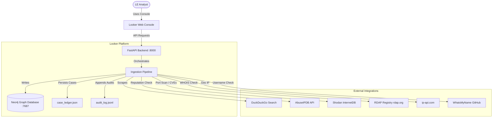
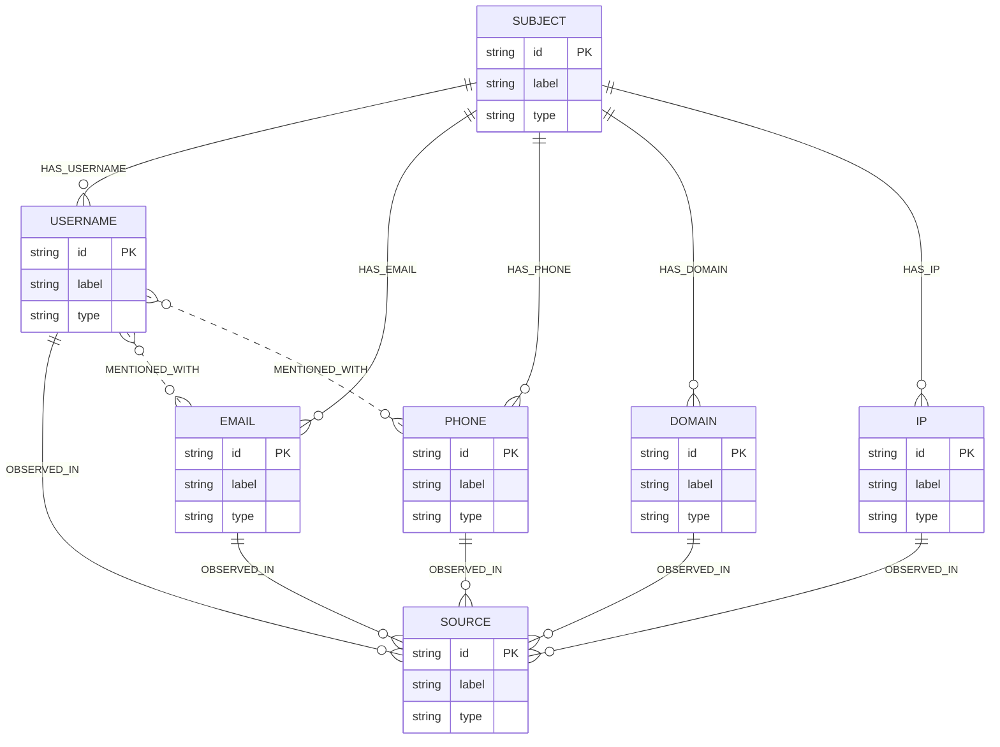

# Project Documentation

## 1. Executive Summary

### Project Overview
The **Looker Threat Intelligence Platform** (also known as the Scammer Mapping & Threat Intel system) is a web-based threat investigation and correlation platform designed for law enforcement analysts (such as police cyber cells). The system accepts a public indicator (e.g., username, email, phone number, domain, or IP address) and automatically aggregates public intelligence from open-source intelligence (OSINT) feeds, normalizes and resolves entities, maps threat connections, and provides visual correlation graphs and geographic maps to uncover cybercrime networks.

### Business Problem Solved
Threat intelligence analysts and law enforcement operators face difficulties in manually gathering and correlating scattered digital footprints across different online spaces. Identifying links between phone numbers, emails, domains, and usernames requires querying multiple third-party databases, search engines, and registrar lookup services. This manual triage is:
* **Time-consuming**: Operators must manually search for each indicator.
* **Error-prone**: Subtle links and shared infrastructure go unnoticed.
* **Difficult to visualize**: Lacks a unified graph view representing the network of relationships.
* **Traceability-challenged**: Lacks immutable auditing of lookups, hindering formal legal processes.

### Key Objectives and Expected Outcomes
* **Unified OSINT Collection**: Automate multi-platform scraping (WhatsMyName, DNS, RDAP/WHOIS, AbuseIPDB, Shodan, DuckDuckGo) from a single query.
* **Automatic Entity Resolution**: Deduplicate and link indicators based on direct observations and text-mined context.
* **Visual Network Mapping**: Display relationships using an interactive, color-coded Cytoscape graph showing primary and inferred edges.
* **Geographic Mapping**: Track threat infrastructure locations using a Leaflet-based geospatial map.
* **Operational Integrity**: Maintain case ledgers and compliance audit logs of all queries to support chain-of-custody tracking.

---

## 2. Project Purpose and Goals

### Core Functionality and Use Cases
* **Indicator Querying**: Input a query value (e.g., phone number, IP address) and trigger an automated collection pipeline.
* **Multi-Source Scraping**: Pull active intelligence from:
  * *Usernames*: Concurrently check profile availability on 500+ sites (via WhatsMyName schema).
  * *Domains*: Query DNS A-records and RDAP domain registrar WHOIS records.
  * *IP Addresses*: Check reputation scores on AbuseIPDB, lookup open ports and CVE vulnerabilities on Shodan InternetDB, and geolocate via ip-api.
  * *Emails/Phones*: Search for web mentions using DuckDuckGo scraping.
* **Incremental Case Logging**: Record each investigation as a "case" containing raw indicators, source hits, confidence metrics, and structural metadata.
* **Graph and Map Visualization**: Display threat infrastructure, observed identifiers, and inferred linkages in a cytoscape network graph and geolocate targets on Leaflet.

### Target Users and Stakeholders
* **Law Enforcement Cyber Investigators**: Main operators performing triage on suspect indicators to map scam syndicates.
* **Threat Intel Analysts**: Product owners and technical leads analyzing security threats.
* **Security Compliance Officers**: Reviewing audit logs to verify lawful access and trace query workflows.

### Success Criteria
* **Execution Latency**: Ingest, normalize, resolve, write to graph database, and return results to the analyst within a single request.
* **Low False Positives**: High-precision normalization and resolution rules to avoid linking unrelated entities.
* **Operator Resilience**: Graceful fallbacks (e.g., using in-memory graph structures if Neo4j is offline) to prevent platform downtime.

---

## 3. System Architecture

### High-Level Architecture Overview
The platform contains **two distinct, parallel architectures** in the repository:
1. **Python FastAPI + Modular Collectors Architecture (Active)**: A Python 3 backend that runs FastAPI to serve a single-page HTML application and execute an orchestrator pipeline synchronously.
2. **Node.js Express + MongoDB + Vite Frontend (Legacy/Alternative)**: A Node.js Express server running scrapers, connecting to MongoDB, and spawning python sub-processes to train transformer embeddings.

*Note: As per the active startup configuration (`START.bat`), only the **FastAPI/Python** architecture is executed for operational use, with Docker managing the backing Neo4j database.*

### Architectural Style
* **Modular Pipeline / Monolith**: The Python application is built as a modular monolith, utilizing an orchestrator class that coordinates specialized collector, normalization, resolution, and database-writing services.
* **Asynchronous Fallbacks**: Uses `BackgroundTasks` in FastAPI for non-blocking writes to the Neo4j graph database, falling back to a synchronized in-memory database store if Neo4j is unreachable.

### Major Components and Their Responsibilities
* **Ingestion Orchestrator (`services/orchestrator.py`)**: Coordinates the pipeline. Selects the primary collector, extracts secondary indicators, triggers normalizers, executes entity resolution, and formats the output.
* **Modular Collectors (`collectors/`)**: Inherit from `BaseCollector` and query third-party APIs or search engines:
  * `UsernameCollector`: Connects to the WebBreacher WhatsMyName repository to download site checks and run up to 80 threads checking accounts.
  * `EmailCollector` & `PhoneCollector`: Scrape search snippets from DuckDuckGo and mock data.
  * `DomainCollector`: Resolves DNS A-records and contacts RDAP registry endpoints.
  * `IPCollector`: Integrates with AbuseIPDB, ip-api, and Shodan.
* **Observation Normalizer (`services/normalizer.py`)**: Standardizes input strings (e.g., lowercasing, stripping `@` signs, formatting IP addresses and phone numbers).
* **Entity Resolver (`services/entity_resolution.py`)**: Deduplicates observations and searches text snippets using regular expressions to extract implicit mentions (e.g., linking a username to an email address mentioned in its search result).
* **Correlation Engine (`services/correlation_engine.py`)**: Transforms resolved entities and relationships into standard Cytoscape elements (nodes and edges).
* **Graph Database Writer (`services/graph_writer.py`)**: Integrates Cypher queries to persist elements into Neo4j or write them to the local `GRAPH_STORE` memory map.
* **Web UI Console (`index.html.html`)**: Single-file frontend constructed using CSS glassmorphism, native JS fetch client, Leaflet Map, and Cytoscape Canvas.

### Architecture Diagrams

#### System Context Diagram
Shows how users interact with the system and how it integrates with external data providers.


#### Component Diagram
Highlights internal Python backend modules and their dependencies.
```mermaid
component-diagram
    component [Ingestion Orchestrator] as Orch
    component [Base Collector] as BaseColl
    component [Username Collector] as UserColl
    component [Email Collector] as EmailColl
    component [Domain Collector] as DomColl
    component [Phone Collector] as PhoneColl
    component [IP Collector] as IPColl
    component [Observation Normalizer] as Norm
    component [Entity Resolver] as Res
    component [Correlation Engine] as CorEngine
    component [Graph Database Writer] as GraphWriter
    
    Orch ..> BaseColl : initializes
    BaseColl <|-- UserColl
    BaseColl <|-- EmailColl
    BaseColl <|-- DomColl
    BaseColl <|-- PhoneColl
    BaseColl <|-- IPColl
    
    Orch ..> Norm : invokes
    Orch ..> Res : invokes
    Res ..> CorEngine : feeds resolved data
    CorEngine ..> GraphWriter : outputs cytoscape elements
```

#### Data Flow Diagram
Maps data transformation from raw inputs to persisted threat intelligence.
```mermaid
dfd
    graph TD
        RawInput([Raw Indicator Input]) -->|1. Route| Orch[Orchestrator]
        Orch -->|2. Query| Collectors[Modular Collectors]
        Collectors -->|3. RawObservations| Normalizer[Observation Normalizer]
        Normalizer -->|4. NormalizedObservations| Resolver[Entity Resolver]
        Resolver -->|5. ResolvedEntities| CorEngine[Correlation Engine]
        CorEngine -->|6. Cytoscape Elements| Writer[Graph Database Writer]
        
        Writer -->|7a. Persist Graph| Neo4j[(Neo4j DB)]
        Writer -->|7b. Fallback Memory| InMemory[(GRAPH_STORE)]
        Orch -->|8. Record Case| Ledger[(case_ledger.json)]
        Orch -->|9. Audit Log| Audit[(audit_log.jsonl)]
```

#### Sequence Diagram
Details request-response lifecycle for an entity investigation.
```mermaid
sequenceDiagram
    autonumber
    actor Analyst
    participant UI as Web Console (index.html.html)
    participant API as FastAPI (app.py)
    participant Orch as IngestionOrchestrator
    participant Coll as Collectors
    participant Res as EntityResolver
    participant Neo as Neo4j DB
    
    Analyst->>UI: Input indicator (e.g., Username: "scammer_1") & click Scan
    UI->>API: POST /api/investigate {selector, value}
    API->>Orch: IngestionOrchestrator.run(selector, value)
    Orch->>Coll: PrimaryCollector.collect(value)
    Coll-->>Orch: List[RawObservation]
    Note over Orch, Coll: If username, queries WMN; if IP, queries Shodan/AbuseIPDB/ip-api
    Orch->>Orch: Extract secondary queries from logs & query secondary collectors
    Orch->>Orch: Normalize observations
    Orch->>Res: EntityResolver.resolve(normalized_obs)
    Res-->>Orch: List[ResolvedEntity]
    Orch->>Res: EntityResolver.extract_implicit_relationships(resolved_entities)
    Res-->>Orch: implicit_links
    Orch-->>API: Extraction result dictionary
    API->>Neo: BackgroundTask: write_to_neo4j(graph_elements)
    API->>API: Persist in-memory GRAPH_STORE fallback
    API->>API: Append case entry to case_ledger.json
    API->>API: Append audit log event to audit_log.jsonl
    API-->>UI: Return HTTP 200 (json payload)
    UI->>UI: Render Cytoscape Graph & Leaflet Map
    UI->>Analyst: Update interface with scan results
```

#### Deployment Diagram
Details runtime nodes, network interfaces, and database backends.
```mermaid
flowchart TD
    subgraph Host Machine (Windows OS)
        subgraph Docker Desktop Sandbox
            NeoContainer[Neo4j Container :5] -->|Bolt Protocol :7687| HostNet[Host Loopback]
            MongoContainer[MongoDB Container :latest] -->|Mongo Protocol :27017| HostNet
            RedisContainer[Redis Container :7.2-alpine] -->|Redis Protocol :6379| HostNet
        end
        
        subgraph Local Service Runtime
            Uvicorn[Uvicorn Server] -->|Runs| FastAPIApp[FastAPI app.py :8000]
            FastAPIApp -->|Reads/Writes| LocalFiles[case_ledger.json, audit_log.jsonl]
            FastAPIApp -->|Connects| HostNet
            
            NodeEngine[Node.js Runtime] -->|Runs| ExpressApp[Express server.js :4001]
            ExpressApp -->|Connects| HostNet
            
            ViteServer[Vite Dev Server] -->|Serves frontend/ :3100| Browser[Web Browser]
            Browser -->|Proxies /api| ExpressApp
        end
    end
    
    Browser -->|Access Console| FastAPIApp
    FastAPIApp -->|HTTPS Outbound| Internet((Public Internet APIs))
```

---

## 4. Project Structure Analysis

```text
Looker-threat-intel-platform/
├── .env                          # Local environment secrets and server configs
├── .gitignore                    # Version control exclusion rules
├── START.bat                     # Host execution script for starting Docker and app.py
├── USER_GUIDE.md                 # Basic system overview and configuration instructions
├── PROJECT_DOCUMENTATION.md      # Detailed architectural specification (This file)
├── app.py                        # Entrypoint for FastAPI backend & single-page server
├── celery_app.py                 # Configuration setup for celery distributed tasks
├── case_ledger.json              # Local JSON file database storing past investigation cases
├── audit_log.jsonl               # Immutable audit log file in JSON Lines format
├── intel_self_trainer.pkl        # Pickle binary file containing legacy model parameters
├── looker_phone_client.py        # CLI phone dork script supporting direct or RapidAPI requests
├── package.json                  # NPM dependencies and development dev-server scripts
├── requirements.txt              # Pip requirements file for Python dependencies
├── vite.config.js                # Vite bundler config mapping port 3100 to port 4001
├── index.html.html               # Main dashboard UI file served by app.py
│
├── backend/                      # Alternative Node.js Express Backend
│   ├── auth.js                   # JWT token generation and verification middleware
│   ├── db.js                     # Neo4j and Mongoose MongoDB connection clients
│   ├── ml_worker.py              # PyTorch + Transformers Logistic Retrainer (called by Cron)
│   ├── osint.js                  # Axios endpoints pulling phishing lists and AbuseIPDB data
│   ├── scraper.js                # Scraper orchestrator that writes raw feeds to Mongo & Neo4j
│   └── server.js                 # Express server routing, cron configs, and health checks
│
├── collectors/                   # Modular OSINT Collector Subsystem
│   ├── base_collector.py         # Abstract base class and RawObservation model
│   ├── username_collector.py     # WhatsMyName website concurrent accounts checking client
│   ├── email_collector.py        # HaveIBeenPwned-style breaches mock + DuckDuckGo search dork
│   ├── domain_collector.py       # Socket IP resolver and rdap.org WHOIS registry parser
│   ├── phone_collector.py        # Country prefix detector and phone number mention scraper
│   ├── ip_collector.py           # AbuseIPDB ratings, ip-api geolocation, and Shodan ports
│   └── wmn-data.json             # Cached WhatsMyName site check profile array (260KB+)
│
├── config/                       # Platform Configuration
│   └── database.py               # Settings validator and GraphDatabaseConnection helper
│
├── frontend/                     # Alternative Vite Frontend Files
│   ├── index.html                # Entry HTML with Strict CSP settings
│   ├── main.js                   # Native JS importing Cytoscape from unpkg.com
│   └── style.css                 # Theme styles for alternative dashboard
│
├── scratch/                      # Debugging Scripts
│   └── verify_pipeline.py        # Execution script validating collectors and normalizers
│
└── services/                     # Pipeline Processing Subsystem
    ├── correlation_engine.py     # Cytoscape nodes and edges generator
    ├── entity_resolution.py      # Deduplicator and text-regex mentions identifier
    ├── graph_writer.py           # Neo4j and local memory graph writer
    ├── ml_engine.py              # Empty stub marking machine learning deprecation
    ├── normalizer.py             # Strips invalid formats and cleans indicators
    ├── orchestrator.py           # Ingestion orchestrator coordinating pipeline
    └── osint_worker.py           # Duplicate async ingestion worker designed for Celery
```

---

## 5. Technology Stack

### Programming Languages
* **Python 3.10+**: Powering the main FastAPI platform, Celery async definitions, and machine learning modules.
* **JavaScript (Node.js ES6)**: Implementing the alternative Express API backend.
* **HTML5 / CSS3**: UI structure, flex layouts, and glassmorphism styling.

### Frameworks and Core Libraries
* **FastAPI**: Asynchronous Python micro-framework handling routing, validation, and JSON serialization.
* **Uvicorn**: High-performance ASGI web server implementing Windows policies.
* **Express.js**: Backend framework hosting proxy endpoints and scheduling crons.
* **Vite**: Asset compiler and dev server handling front-end modules.
* **Pydantic / Pydantic Settings**: Class validator defining schemas and environment bindings.

### Databases and Storage
* **Neo4j 5**: Native property graph database mapping threat indicator nodes and relationship edges.
* **MongoDB**: NoSQL document store housing raw, unstructured OSINT feeds.
* **Redis**: In-memory data broker facilitating Celery task states.
* **Local File Stores**:
  * `case_ledger.json`: Structured Case array backup.
  * `audit_log.jsonl`: Append-only JSON Lines stream.

### Machine Learning Stack (Alternative Backend)
* **PyTorch (torch)**: Deep learning framework backing sentence-embedding models.
* **Transformers (Hugging Face)**: Loads `distilbert-base-uncased` to encode raw texts.
* **Scikit-learn (sklearn)**: Classifier training (Logistic Regression / SGDClassifier).
* **Joblib**: Model serialization and storage.

### Testing and Utilities
* **Requests / Axios**: Outbound HTTP network querying.
* **Node-cron**: Express-level scheduler coordinating scraper intervals.

---

## 6. Feature Breakdown

### Feature 1: Multi-Indicator OSINT Investigation
* **Description**: Allows analysts to scan an indicator (username, email, phone, domain, IP) and harvest external metadata.
* **Business Value**: Combines open-source search tools into a unified interface, reducing analysis time.
* **Implementation Approach**: Synchronously queries primary APIs, extracts matching patterns from response text, and triggers secondary collectors to identify secondary connections.
* **Key Modules**:
  * Ingestion Orchestrator: [orchestrator.py](file:///c:/Users/abhin/OneDrive/Desktop/looker/Looker-threat-intel-platform/services/orchestrator.py)
  * Collectors: [collectors/](file:///c:/Users/abhin/OneDrive/Desktop/looker/Looker-threat-intel-platform/collectors/)
* **Dependencies**: `requests`, internet access to DuckDuckGo, AbuseIPDB, Shodan, and rdap.org.

### Feature 2: Correlation Graph Generation
* **Description**: Formulates a visual Cytoscape graph showing threat connections.
* **Business Value**: Helps investigators identify shared infrastructure and syndicate structures.
* **Implementation Approach**: Maps resolved items to node types (`subject`, `username`, `email`, `phone`, `domain`, `ip`, `source`) and adds relationship edges (`HAS_IP`, `OBSERVED_IN`, `MENTIONED_WITH`, etc.).
* **Key Modules**:
  * Correlation Engine: [correlation_engine.py](file:///c:/Users/abhin/OneDrive/Desktop/looker/Looker-threat-intel-platform/services/correlation_engine.py)
  * Graph Writer: [graph_writer.py](file:///c:/Users/abhin/OneDrive/Desktop/looker/Looker-threat-intel-platform/services/graph_writer.py)
* **Dependencies**: `neo4j`, Cytoscape.js.

### Feature 3: Interactive Geospatial Mapping
* **Description**: Pinpoints IP address coordinates on a Leaflet map.
* **Business Value**: Highlights the geographic distribution of scam infrastructure.
* **Implementation Approach**: Extracts IP latitude/longitude from ip-api geolocation data, adds div icon markers, and updates the view on coordinate resolution.
* **Key Modules**:
  * UI Integration: [index.html.html](file:///c:/Users/abhin/OneDrive/Desktop/looker/Looker-threat-intel-platform/index.html.html)
  * IP Collector: [ip_collector.py](file:///c:/Users/abhin/OneDrive/Desktop/looker/Looker-threat-intel-platform/collectors/ip_collector.py)
* **Dependencies**: Leaflet.js, ip-api.com.

---

## 7. Current Implementation Status

| Component | Status | Location | Notes |
| :--- | :--- | :--- | :--- |
| **Modular Collectors** | **Fully Implemented** | `collectors/` | Email, Username, Phone, Domain, and IP collectors are operational. |
| **FastAPI Core Routing** | **Fully Implemented** | `app.py` | Routes `/api/investigate`, `/api/graph`, `/api/cases`, `/api/audit` are active. |
| **Graph Visualization** | **Fully Implemented** | `index.html.html` | Cytoscape integration is active. |
| **Geospatial Mapping** | **Fully Implemented** | `index.html.html` | Leaflet integration is active. |
| **Audit Logging** | **Fully Implemented** | `app.py`, `audit_log.jsonl` | Immutable logging to local disk is active. |
| **Celery Tasks** | **Partially Implemented** | `celery_app.py`, `services/osint_worker.py` | Tasks are defined but not utilized by `app.py`. |
| **ML Engine Retraining** | **Partially Implemented** | `backend/ml_worker.py` | Operational on the Node.js backend, but contains a global name scope bug. |
| **FastAPI Machine Learning**| **Missing / Deprecated**| `services/ml_engine.py` | Deprecated and removed; API returns stubbed mock predictions. |
| **Authentication Enforcement**| **Incomplete** | `backend/server.js`, `app.py` | Disabled in Node.js; bypassed in Python if the API key is not set. |
| **Automated Testing** | **Missing** | — | Lacks unit test suites; only has a basic verification script in `scratch/`. |

---

## 8. Current Problems and Challenges

### Architectural Issues

#### 1. Split Backend Architectures
* **Description**: Dual backends (Python FastAPI on port 8000 and Node.js on port 4001) exist in the repository but operate independently, leading to data siloing.
* **Impact**: Mongo collections and scraping logic in Node.js are isolated from the case ledger and collectors in Python. This creates confusion regarding the system's primary stack.
* **Severity**: **High**
* **Evidence**: File structure contains both `backend/server.js` and `app.py`. `START.bat` runs `app.py` but does not initiate the Node.js server.

#### 2. Duplicate Ingestion Logic
* **Description**: The Python stack contains two independent ingestion pipelines. The active one in `app.py` uses modular collectors. The inactive one in `services/osint_worker.py` (Celery) uses legacy, duplicate scraping logic.
* **Impact**: Increases maintenance overhead; updates to collectors in `collectors/` do not apply to the Celery worker task.
* **Severity**: **Medium**
* **Evidence**: [osint_worker.py](file:///c:/Users/abhin/OneDrive/Desktop/looker/Looker-threat-intel-platform/services/osint_worker.py#L172-L230) defines `ingest_and_analyze` using a duplicate DuckDuckGo parser instead of using `IngestionOrchestrator`.

---

### Code Quality Issues

#### 1. NameError Scope Bug in `ml_worker.py`
* **Description**: The retrainer imports `numpy` locally inside `main()`, but `compute_embeddings()` references `np` globally.
* **Impact**: Spawning model retraining via the Node.js API or cron job causes a `NameError: name 'np' is not defined` crash.
* **Severity**: **High**
* **Evidence**: [ml_worker.py:L62](file:///c:/Users/abhin/OneDrive/Desktop/looker/Looker-threat-intel-platform/backend/ml_worker.py#L62) calls `np.concatenate`, while `import numpy as np` is defined at [ml_worker.py:L77](file:///c:/Users/abhin/OneDrive/Desktop/looker/Looker-threat-intel-platform/backend/ml_worker.py#L77).

#### 2. Lack of Automated Test Suites
* **Description**: The codebase has no automated test coverage (e.g., pytest or Jest).
* **Impact**: Changes to collectors or normalizers could introduce regressions.
* **Severity**: **Medium**
* **Evidence**: The project lacks test directories, test config files, or unit tests.

---

### Performance Issues

#### 1. Blocking Node.js Scraper Loop
* **Description**: The Express scraper fetches a large phishing database text file and writes nodes sequentially inside a `for` loop using await queries.
* **Impact**: Blocks the single-threaded Node.js event loop, causing API timeouts and database connections to drop under load.
* **Severity**: **High**
* **Evidence**: [scraper.js:L6-L14](file:///c:/Users/abhin/OneDrive/Desktop/looker/Looker-threat-intel-platform/backend/scraper.js#L6-L14) processes domains sequentially without batching.

#### 2. Synchronous File Writes Under Lock
* **Description**: `app.py` locks and rewrites `case_ledger.json` synchronously on every search query.
* **Impact**: Blocks execution threads under concurrent load, leading to performance bottlenecks and potential file corruption.
* **Severity**: **Medium**
* **Evidence**: [app.py:L80-L85](file:///c:/Users/abhin/OneDrive/Desktop/looker/Looker-threat-intel-platform/app.py#L80-L85) implements synchronous JSON file writes under lock.

---

### Security Risks

#### 1. Bypassed API Authentication
* **Description**: If the API key is not configured in the host environment, the authentication middleware skips API key checks.
* **Impact**: Unauthenticated users can query system resources if default environment variables are missing.
* **Severity**: **High**
* **Evidence**: [app.py:L149-L153](file:///c:/Users/abhin/OneDrive/Desktop/looker/Looker-threat-intel-platform/app.py#L149-L153) bypasses authentication if `API_KEY` is falsy.

#### 2. Missing Authentication in Node.js Backend
* **Description**: The Node.js Express server does not apply JWT authentication middleware to its endpoints.
* **Impact**: Allows unauthenticated users to trigger scraper runs or run training processes.
* **Severity**: **High**
* **Evidence**: [server.js](file:///c:/Users/abhin/OneDrive/Desktop/looker/Looker-threat-intel-platform/backend/server.js) does not import or apply authentication middleware.

#### 3. Strict Content Security Policy (CSP) Mismatches
* **Description**: The Vite frontend HTML applies a strict CSP that blocks external script sources, but references external scripts (e.g., Cytoscape on unpkg.com).
* **Impact**: The browser blocks external scripts, breaking the graph rendering engine.
* **Severity**: **High**
* **Evidence**: [frontend/index.html:L9](file:///c:/Users/abhin/OneDrive/Desktop/looker/Looker-threat-intel-platform/frontend/index.html#L9) restricts `script-src` to `'self'`, but [frontend/index.html:L24](file:///c:/Users/abhin/OneDrive/Desktop/looker/Looker-threat-intel-platform/frontend/index.html#L24) loads Cytoscape from unpkg.com.

---

### Operational Risks

#### 1. Credentials Configuration Inconsistencies
* **Description**: Neo4j credentials vary across the environment file, python variables, and docker-compose files.
* **Impact**: Leads to database connection failures during deployment.
* **Severity**: **High**
* **Evidence**: `docker-compose` uses `HardenedLEPassword2026!`, `docker-compose.yml` uses `${NEO4J_PASSWORD}`, and `app.py` defaults to `password123`.

#### 2. Single Point of Failure (Local File Database)
* **Description**: Case history and audit trails are written to local files on the server instance.
* **Impact**: Impedes horizontal scaling, as instances cannot share state. System crashes could result in data loss.
* **Severity**: **Medium**
* **Evidence**: Cases are written to `case_ledger.json` and audits to `audit_log.jsonl`.

---

## 9. Potential Solutions and Recommendations

### 1. Consolidate Backend Architectures
* **Recommendation**: Standardize the project on the Python FastAPI architecture. Port the Node.js scraper, MongoDB storage, and ML training pipelines to Python.
* **Expected Benefits**: Simplifies the stack, reduces maintenance overhead, and ensures consistent data storage.
* **Complexity**: Medium
* **Priority**: **Immediate**
* **Risks/Trade-offs**: Requires migrating current Node.js code and MongoDB models to FastAPI.

### 2. Standardize Ingestion Pipelines
* **Recommendation**: Refactor the Celery worker task in `osint_worker.py` to import and execute `IngestionOrchestrator` instead of running legacy scraper logic.
* **Expected Benefits**: Ensures consistent intelligence extraction and normalization across both synchronous API calls and async tasks.
* **Complexity**: Low
* **Priority**: **Immediate**
* **Risks/Trade-offs**: Minimal risk.

### 3. Resolve the Global Scope Bug in `ml_worker.py`
* **Recommendation**: Move `import numpy as np` to the global imports block at the top of the file.
* **Expected Benefits**: Resolves execution crashes during ML model training.
* **Complexity**: Low
* **Priority**: **Immediate**
* **Risks/Trade-offs**: None.

### 4. Implement Robust Security Authentication
* **Recommendation**: Update `app.py` to enforce authentication even when `API_KEY` is not set. Apply JWT authentication to the Node.js server.
* **Expected Benefits**: Protects endpoints from unauthorized access.
* **Complexity**: Medium
* **Priority**: **Immediate**
* **Risks/Trade-offs**: Requires setting up secrets management before deployment.

### 5. Standardize CSP and External Dependencies
* **Recommendation**: Update CSP rules to authorize CDNs like `unpkg.com` and `cdnjs.cloudflare.com`, or vendor script files locally.
* **Expected Benefits**: Resolves script execution failures while maintaining security.
* **Complexity**: Low
* **Priority**: **Immediate**
* **Risks/Trade-offs**: Expanding CSP rules increases the attack surface slightly.

---

## 10. Data Model Analysis

### Database Schema Overview
The platform uses two database models:
1. **Neo4j Graph Model**: Connects threat indicators to entities.
2. **Local File / Document Store Model**: Stores case structures and audit logs.

### Entity Relationship (ER) Diagram (Neo4j Graph Model)
The diagram below maps the Neo4j schema, including labels and relationships.


---

## 11. API Analysis

### Available API Endpoints (Python FastAPI Backend)

#### 1. Investigate Entity
* **Endpoint**: `POST /api/investigate` (and v1 alias `POST /api/v1/looker/investigate`)
* **Request Header**: `x-api-key` (String, Optional/Conditional)
* **Request Body**:
  ```json
  {
    "selector": "Username",
    "value": "scammer_1"
  }
  ```
* **Response Pattern**:
  ```json
  {
    "status": "Success",
    "input": "scammer_1",
    "extracted_intelligence": {
      "scammer_alias": "username::a1b2c3d4",
      "observation_state": "observed",
      "source_reliability": 0.85,
      "associated_email": "example@email.com",
      "shared_identifiers": ["example@email.com", "scammer_1"],
      "shared_contacts": [],
      "shared_infrastructure": [],
      "raw_indicators": { ... },
      "source_query": "scammer_1",
      "collection_errors": [],
      "source_hits": [ { ... } ],
      "collector_hits": [ { ... } ],
      "public_sources": { ... }
    },
    "ai_analysis": {
      "is_linked_to_known_syndicates": false,
      "confidence_score": 1.0,
      "feature_vector": [1.0, 1.0, 1.0],
      "selector_hint": "Username",
      "matched_cases": [],
      "model_note": "Looker OSINT active intelligence graph generation."
    },
    "case": { ... }
  }
  ```

#### 2. Get Network Graph
* **Endpoint**: `GET /api/graph` (and v1 alias `GET /api/v1/looker/network`)
* **Response Pattern**: Returns an array of Cytoscape elements (nodes and edges).

#### 3. Get Cases
* **Endpoint**: `GET /api/cases`
* **Response Pattern**: Returns the most recent 100 cases from the case ledger.

#### 4. Get Audit Log
* **Endpoint**: `GET /api/audit`
* **Response Pattern**: Returns audit log events.

---

### Alternative Node.js API Endpoints
* `GET /api/search?q=...`: Searches Neo4j for entities matching the query name.
* `POST /api/ingest`: Triggers a phishing domain and blacklist IP scraping run.
* `POST /api/train`: Retrains the machine learning model.
* `GET /api/health`: Basic health check.

---

## 12. Deployment and Operations

### Build Process
The project runs as an interpreted Python application, meaning it does not require a compilation step. The alternative frontend utilizes Vite, which compiles static files into the `dist/` directory via `npm run build`.

### Deployment Workflow
1. Clone the repository to the host server.
2. Configure environment variables in `.env`.
3. Launch container databases:
   ```bash
   docker-compose up -d
   ```
4. Install dependencies and start the server:
   ```powershell
   START.bat
   ```

### Runtime Dependencies
* Docker Desktop or Docker Engine.
* Python 3.10 runtime environment.
* Node.js runtime environment (if using the alternative backend).

---

## 13. Testing Assessment

### Existing Test Coverage
The project has **0% automated test coverage**. There are no unit or integration tests configured. A sanity script `scratch/verify_pipeline.py` is available to test collectors locally.

### Recommendations for Improvement
* **Integrate pytest**: Add unit tests for normalizers, entity resolvers, and collectors.
* **Mock External API Requests**: Use `requests-mock` or `pytest-mock` to test collectors without querying live services.
* **Integrate CI/CD**: Run test suites automatically on branch pull requests using GitHub Actions.

---

## 14. Future Roadmap

### Short-Term Improvements (1-3 Months)
* Unify the backend stack under the Python architecture and remove the Node.js folder.
* Resolve the scope import bug in `ml_worker.py`.
* Implement automated unit testing in the CI/CD pipeline.

### Medium-Term Enhancements (3-6 Months)
* Implement database-backed case ledger and audit log stores to support horizontal scaling.
* Migrate the Celery pipeline to use the modular python collector classes.
* Enforce authentication for all API endpoints.

### Long-Term Architectural Evolution (6+ Months)
* Transition the platform into a microservices architecture, decoupling collectors into independent services to handle scaling challenges.
* Add user authentication and role-based access controls (RBAC) to restrict access to sensitive threat intelligence data.

---

## 15. Appendix

### Glossary
* **Indicator**: A piece of threat data (e.g., username, IP address) used to identify malicious activity.
* **OSINT**: Open-Source Intelligence collected from public sources.
* **RDAP**: Registration Data Access Protocol (modern replacement for WHOIS).
* **WhatsMyName (WMN)**: An open-source database used to verify if a username exists on various websites.
* **Cytoscape**: A graph visualization library used to map networks of related data.

### Key Dependencies
* **FastAPI**: Backend web framework.
* **Neo4j Driver**: Graph database interface.
* **Scikit-learn**: Machine learning tools.
* **Leaflet**: Geospatial mapping tools.
