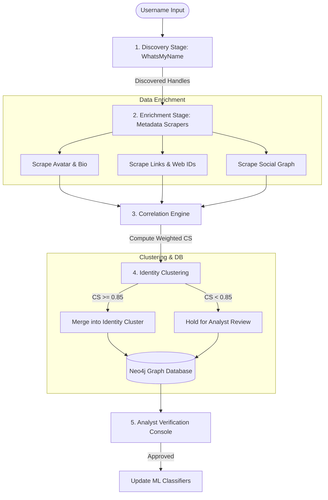

# Username Validation & Identity Attribution Analysis
**Role**: Senior OSINT Engineer & Digital Investigations Architect  
**Subject**: Critical Evaluation of Username-Based OSINT Discovery and Attribution  

---

## 1. Executive Summary: The False Positive Trap
A common architectural flaw in automated open-source intelligence (OSINT) platforms is treating a **successful username match** as proof of **identity attribution**. 

When a WhatsMyName-style check returns a status code of `200` (meaning a profile with that handle exists on a platform), treating this as a "validated target profile" introduces high false-positive rates. In digital forensics and law enforcement, attribution requires establishing a link between an online account and a physical person that stands up to evidentiary scrutiny.

This document analyzes the limits of username enumeration, proposes a decoupled discovery-enrichment-correlation architecture, and details a mathematical scoring framework for identity clustering.

---

## 2. Username Enumeration alone vs. Real Attribution

### Why Enumeration Produces False Positives
* **Handle Collision**: Common handles (e.g., `coder99`, `shadow_runner`, `john_smith`) are independently selected by different users across different platforms.
* **Name Squatting & Impersonation**: Scammers register matching handles of high-profile targets or organizations to conduct phishing or brand damage.
* **Service Default Names**: Some systems auto-assign or default usernames based on email prefixes, resulting in unrelated users holding matching handles.

### The Semantic Gap
There is a fundamental difference in evidentiary value between these two assertions:

$$\text{"A profile with username } U \text{ exists on platform } P\text{"} \quad \neq \quad \text{"Profile } U \text{ on platform } P \text{ belongs to target } T\text{"}$$

* **Profile Existence**: A database lookup verifying that a key is taken. It contains zero attribution value on its own.
* **Target Attribution**: A verified association based on corroborating data (e.g., matching EXIF data in photos, shared email hashes, or identical recovery phone digits).

### Common Causes of Mistaken Identity
1. **Platform Handover**: Discarded or expired handles on platforms (like Twitter or Instagram) are re-registered by completely different users.
2. **Shared Accounts**: Multiple individuals (e.g., a family or a cybercrime group) using the same handle.
3. **Automated Bots**: Mass-registered spam accounts using dictionary words that happen to match a target's niche alias.

---

## 3. The Path from Discovery to Attribution

Professional threat intelligence platforms split the workflow into distinct operational phases:

```
[ Discovery ] ──► [ Enrichment ] ──► [ Correlation ] ──► [ Clustering ] ──► [ Attribution ]
```

1. **Discovery (Low Confidence)**: Identifying candidate profiles using automated checks (e.g., WhatsMyName).
2. **Enrichment (Data Gathering)**: Scraping profile metadata (avatars, bio text, locations, connections).
3. **Correlation (Signal Matching)**: Comparing metadata indicators against known target vectors.
4. **Identity Clustering (Grouping)**: Merging highly correlated profiles into a single entity representation.
5. **Attribution (High Confidence)**: Verifying the identity cluster through manual analyst review or cryptographic ties (e.g. PGP keys).

---

## 4. Multi-Signal Enrichment & Correlation

To transition from discovery to attribution, the engine must harvest and compare the following signals:

| Signal Type | Evidentiary Strength | Extraction Technique |
| :--- | :--- | :--- |
| **Profile Photos** | **High** | Face matching (dlib/OpenCV) and perceptual hashing (pHash) comparisons. |
| **Linked Websites**| **High** | Matching tracker IDs (Google Analytics, AdSense), WHOIS details, or custom domains. |
| **Recovery Info** | **Critical** | Comparing masked recovery emails/phones (e.g., `j***e@g***.com` matching target). |
| **Bio & Interests**| **Medium** | NLP analysis (TF-IDF or embedding vector cosine similarity) of bio keywords. |
| **Geo-Location** | **Medium** | Extracted location strings, IP addresses, timezone offsets, or language dialects. |
| **Social Graph** | **High** | Overlapping friend lists, followers, or co-mentions across platforms. |

---

## 5. Mathematical Correlation Scoring Framework

A correlation engine can combine these signals into a unified **Identity Correlation Score** ($CS$). 

Let $S_i$ be the score of a matched signal (between $0.0$ and $1.0$), and $W_i$ be the weight of that signal type based on its uniqueness and susceptibility to spoofing:

$$CS = \frac{\sum (S_i \times W_i)}{\sum W_i}$$

### Weighted Scoring Configuration

```
┌───────────────────────────┬─────────────┬────────────────────────────────────────┐
│ Signal (i)                │ Weight (Wi) │ Scoring Logic (Si)                     │
├───────────────────────────┼─────────────┼────────────────────────────────────────┤
│ Recovery Email Mask       │    10.0     │ 1.0 if mask matches; 0.0 otherwise.    │
│ Profile Photo Hash (pHash)│     8.0     │ 1.0 - (Hamming Distance / 64)          │
│ Google Analytics ID       │     8.0     │ 1.0 if identical; 0.0 otherwise.       │
│ Linked Domain/URL         │     6.0     │ 1.0 if matching domain; 0.0 otherwise. │
│ Bio Text Similarity       │     4.0     │ Cosine similarity of NLP embeddings    │
│ Location/Timezone Match   │     3.0     │ 1.0 if matched region; 0.0 otherwise.  │
└───────────────────────────┴─────────────┴────────────────────────────────────────┘
```

### Identity Threshold Classification
* **$CS \ge 0.85$**: **High Confidence Match** (Automatic clustering candidate).
* **$0.50 \le CS < 0.85$**: **Inferred Association** (Requires manual analyst triage).
* **$CS < 0.50$**: **Uncorrelated Profile** (Likely handle collision or unrelated user).

---

## 6. Production-Grade OSINT Pipeline Architecture

To prevent false attribution, a production-grade system must separate **Discovery** from **Enrichment and Correlation** as distinct pipeline stages:



### Architectural Recommendations for Looker
1. **Decouple Ingestion**: Modify `IngestionOrchestrator` to separate initial discovery checks from metadata scraping, making metadata scraping a multi-threaded secondary queue.
2. **Graph Modeling**: Introduce `IdentityCluster` nodes in Neo4j. Discovered account nodes should link to an `IdentityCluster` via a `BELONGS_TO` edge containing the computed `confidence_score` property.
3. **Analyst Review Loop**: Implement an UI interaction in the React dashboard allowing analysts to manually flag false positives (e.g. severing a `BELONGS_TO` relationship), instantly updating the local scoring parameters.
